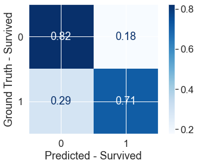
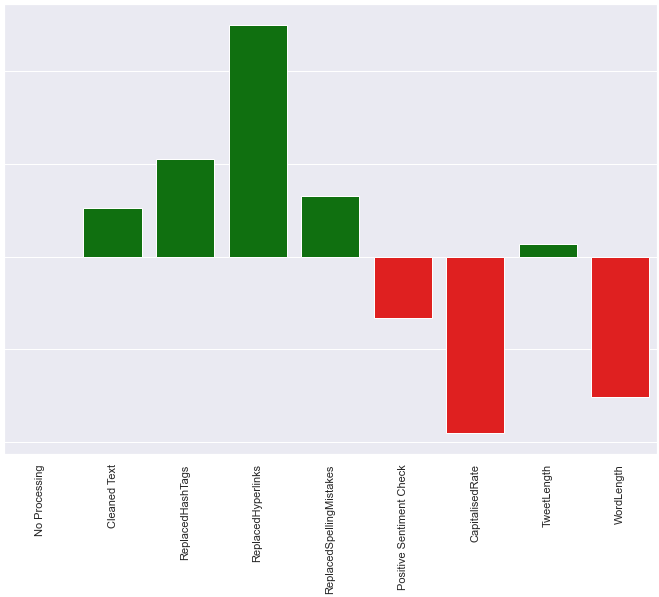

## [Evolving Random Systems](https://github.com/JFJStephenson/MonteCarloSim/blob/main/FindingPiWithMonteCarlo.ipynb)
This project is a brief investigation into randomised sampling, and how by employing Monte-Carlo techniques, you can make predictions and estimations that would otherwise be extremely computationally expensive. 

To summarise:

- Calculate Pi via randomised co-ordinate sampling, exploring the relationship between accuracy and sample size.
- Simulate self-assembly of particles suspended in space with inter-particle attractive forces via the principle of energy minimisation.
- Move particles in random directions and include a randomised chance to accept some energetically unfavourable particle positions in order to prevent the simulation from getting stuck in local minima.
- Use NumPy, Pandas and Object Orientated MatplotLib to produce readable, efficient code and quality figures.  

## [Youtube Trending Videos](https://github.com/JFJStephenson/YoutubeTrendingVideos/blob/main/ViewVsCommentCorrelations.ipynb)
This project is a foray into exploratory data analysis - visualising viewership metrics and some additional information around the sentiment and controversy videos grouped by catagory. 

To summarise:

- Load trending Youtube Video Datasets and perform basic visualisation on some relationships between viewership metrics, i.e. views/comments/dislikes
- Investigate trends which may vary between video catagory and country of origin
- Perform sentiment analysis to find any interesting trends with regards to the sentiment of video descriptions.  

## [Titanic Survivability Predictions](https://github.com/JFJStephenson/Titanic_KaggleProject/blob/main/Comp.ipynb)
This project is a classification problem, based on a number of attributes, i.e. gender, ticket fare, socio-economic class etc predict whether a passanger survived the titanic disaster. This project employed the wisdom of crowds, using an ensamble of weak learners to fill data and a random forest model to make the final predictions 

To summarise:

- Exploratory data analysis - visualising trends between survivability and several passanger attributes   
- Using Cross Validation and the manual creation of an ensamble model fill blanks for passanger age
- Using limited festure selection to avoid overfitting and a degree of careful hyperparameter tuning develop a random forest model.  

## [Disaster Tweet Classifier](https://github.com/JFJStephenson/DisasterTweetFinder/blob/main/Workbook.ipynb)
In this project the purpose was to classify tweets into disaster and non-disaster classes. This project was focussed around some NLP concepts involving pre-processing
the tweet text, extracting and utilising metadata and identifying the effects of each pre-processing step upon the overall accuracy of the models. 
To summarise:

- NLP - pre-processing, cleaning text and utilising TF-IDF tokenisation.
- Analysising the impact of each pre-processing step and selecting only those with a positive impact upon the overall score. 
- Hyperparamater tuning to acheieve optimal results. 

