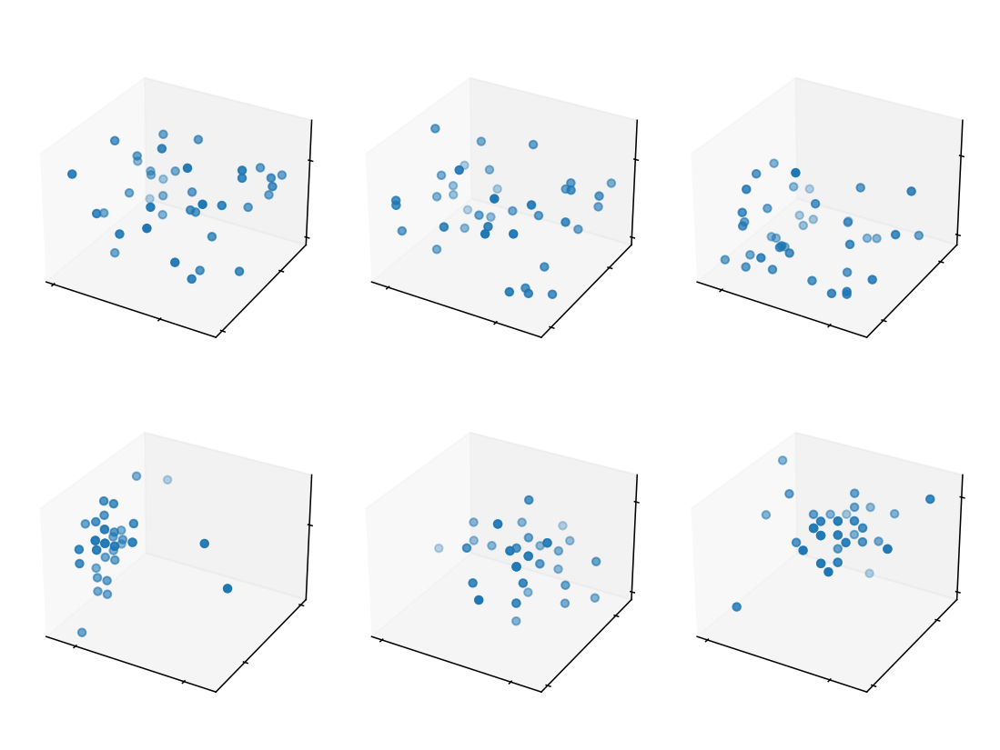
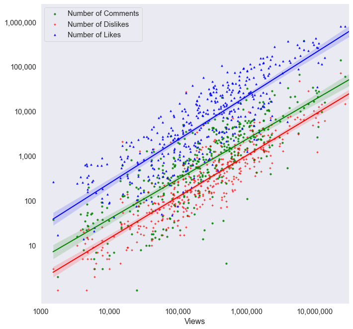

## [Evolving Random Systems](https://github.com/JFJStephenson/MonteCarloSim/blob/main/FindingPiWithMonteCarlo.ipynb)
This project is a brief investigation into randomised sampling, and how by employing Monte-Carlo techniques, you can make predictions and estimations that would otherwise be extremely computationally expensive. 

To summarise:

- Calculate Pi via randomised co-ordinate sampling, exploring the relationship between accuracy and sample size.
- Simulate self-assembly of particles suspended in space with inter-particle attractive forces via the principle of energy minimisation.
- Move particles in random directions and include a randomised chance to accept some energetically unfavourable particle positions in order to prevent the simulation from getting stuck in local minima.
- Use NumPy, Pandas and Object Orientated MatplotLib to produce readable, efficient code and quality figures.  

## [Youtube Trending Videos](https://github.com/JFJStephenson/YoutubeTrendingVideos/blob/main/ViewVsCommentCorrelations.ipynb)
This project is a foray into exploratory data analysis - visualising viewership metrics and some additional information around the sentiment and controversy videos grouped by catagory. 

To summarise:

- Load trending Youtube Video Datasets and perform basic visualisation on some relationships between viewership metrics, i.e. views/comments/dislikes
- Investigate trends which may vary between video catagory and country of origin
- Perform sentiment analysis to find any interesting trends with regards to the sentiment of video descriptions.

